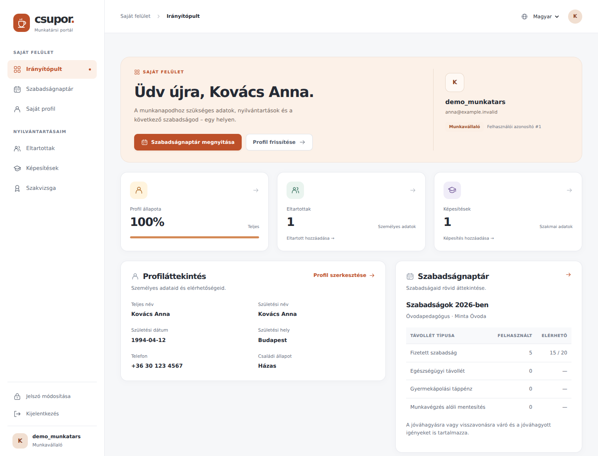
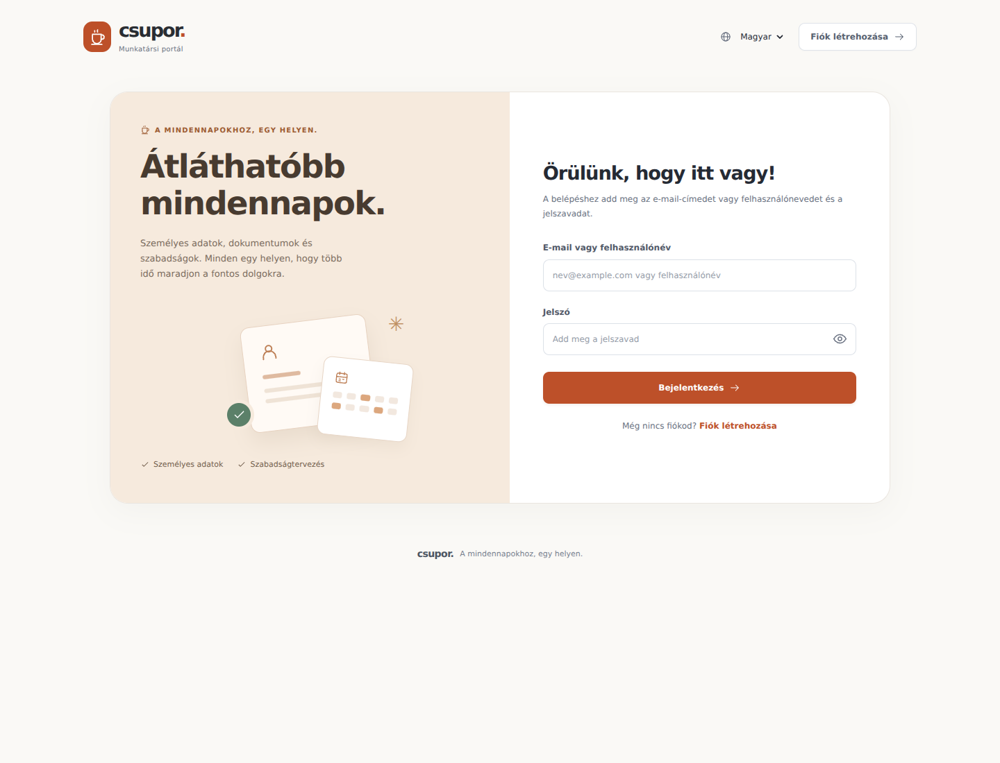
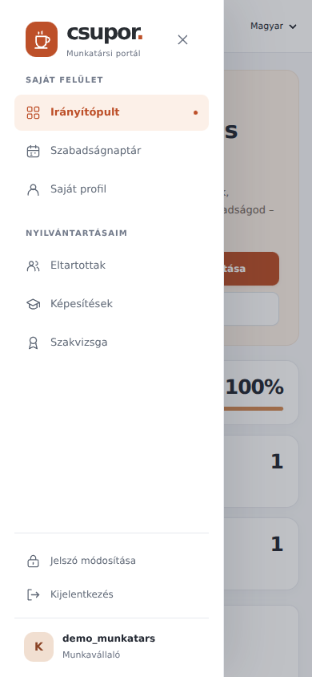

# CSUPOR interface refresh

The portal now uses a light workspace layout with a terracotta accent, a persistent sidebar, clearer action hierarchy and consistent forms, tables and calendar states. On smaller screens, navigation becomes a keyboard-accessible drawer and the leave calendar appears before its request form.

The dashboard presents real profile completion and record counts, followed by personal details, leave balances and role-appropriate administration. Authentication pages share a compact visual identity and include password visibility controls.

## Preview

These screenshots use fictional records in a disposable local SQLite database, with the Hungarian interface selected.

### Dashboard

### Sign in

### Mobile navigation

## Implementation

- `app/static/css/portal.css` contains the shared design system and responsive rules, replacing embedded template styles.
- `app/static/js/portal.js` enhances the mobile menu, password visibility and dismissible messages. The menu supports Escape, focus containment and focus restoration; it remains visible in normal document flow when JavaScript is unavailable.
- The icon and authentication illustration templates use local SVG/CSS. No new application dependencies, external fonts, CDN requests or build steps are needed.
- Form actions and field names retain the existing server contract. The dashboard route supplies the existing profile-completion calculation as a numeric value for its progress indicator.
- Hungarian translations, including the compiled catalogue, accompany the interface. Month labels use the selected locale.

## Verification

- 152 Flask checks across English and Hungarian with employee, HR, CEO and developer accounts verified page rendering and expected permission responses.
- 75 browser checks covered sign in, password visibility, language switching, profile save and reload, calendar date selection, conditional date requirements, mobile drawer keyboard behaviour, role-specific navigation and empty states.
- Layouts checked at 320, 390, 768, 1024 and 1440 pixels; no document-level horizontal overflow or JavaScript errors in the checked views.
- Desktop, mobile, authentication, profile, calendar and administration screenshots inspected.
- Python compilation, JavaScript syntax and `git diff --check` passed.

Validation used a local SQLite database. The production MySQL connection and deployment were not exercised; no schema or business-rule changes are included.
