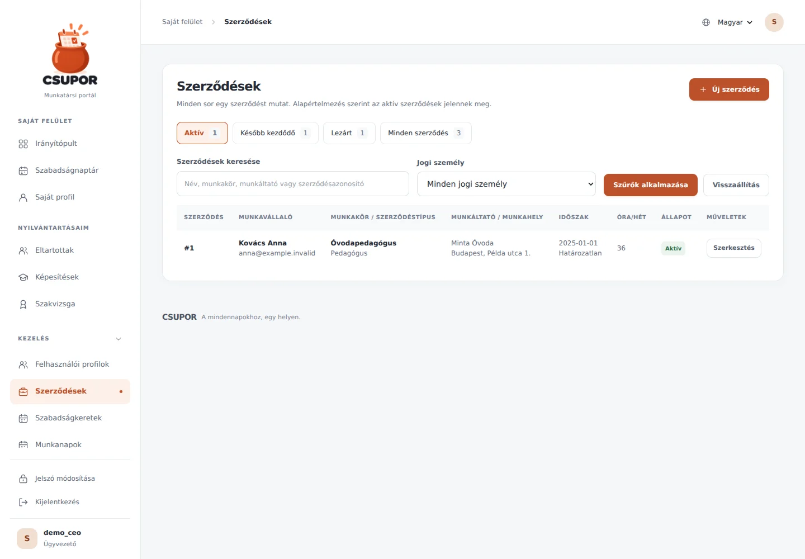
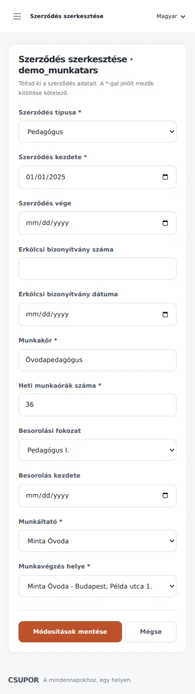

# Hungarian administration and contract lists

The Hungarian interface now uses informal second-person wording consistently. Labels, enum choices, validation failures and save notifications share one translated vocabulary: legal entities are **jogi személyek**, phone numbers are **telefonszám**, and organisation tax numbers are **adószám**. Personal tax identification numbers remain **adóazonosító jel**.

## Behaviour

- New browser sessions use Hungarian even when the browser prefers another language. The header selector still offers English, and an explicit session preference survives login and logout.
- `/profile` has compact, two-line address fields and the requested **Fogyatékosság, tartós betegség** / **Disability, long-term illness** label. **Pedagógusigazolvány** is written as one word. The original change showed the model's 64-character capacity in the label; [the subsequent update](people-context.md) removes that count while retaining input and server validation.
- `/legal-entities` and `/places-of-work` are list pages. Their add buttons open `/new`, and each row links to `/<id>/edit`. Existing `?edit=<id>` links redirect to the corresponding editor. Workplaces no longer show a display-format column.
- `/contracts` lists one row per contract and initially shows contracts active today, including either date boundary. Tabs expose upcoming, ended and all contracts, with counts calculated after search/employer filtering. In the all-contracts view, active contracts come first and ended contracts last.
- Search covers the employee's name/username, job title, employer and numeric contract ID. A separate employer filter is available. New contracts start with an employee chooser that includes employees without a contract.
- Contract editors translate types, classifications, fields and validation messages. Failed submissions preserve entered values; validation finishes before changing the persistent object, avoiding accidental autoflush of invalid edits.
- HR/CEO permissions are retained on the new endpoints. Enum values stored in the database are unchanged, and no schema migration is needed.

## Preview

Screenshots use fictional records in a disposable local database.

## Verification

- 26 automated tests passed, including nine new regression tests covering separate forms, permissions, create/edit flows, invalid submissions, contract filtering/date boundaries, bilingual labels and translation coverage.
- All 592 currently extracted messages have non-empty, non-fuzzy Hungarian translations with valid format placeholders. Enum and approval-policy labels are included through `lazy_gettext` extraction; the compiled catalogue is committed.
- 104 browser page/locale/viewport checks covered English and Hungarian, widths of 320, 390, 768 and 1440 pixels on the ten main affected pages, plus the remaining administrative/personal forms at desktop width.
- Real browser interactions exercised legal-entity and workplace creation/editing, translated save notifications, contract filters and contract editing. No JavaScript errors or document-level horizontal overflow were observed; wide tables scroll inside their own containers.
- Six additional targeted checks verified the final heading and action-button styling. Desktop and mobile screenshots were inspected.

Validation used SQLite and a local headless browser. No production MySQL database or deployment was exercised.
