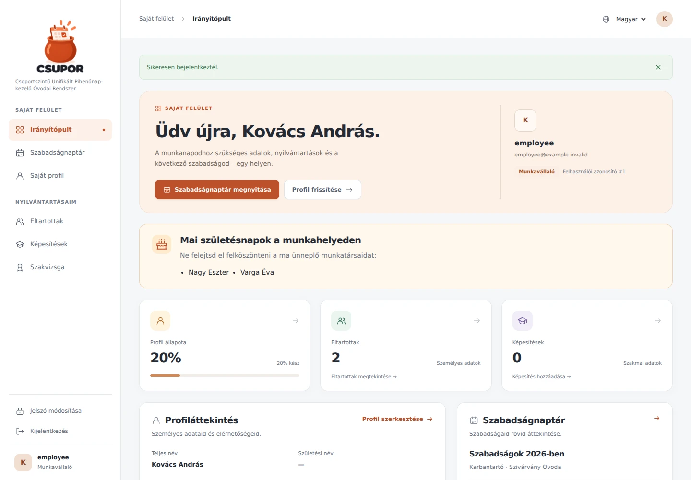
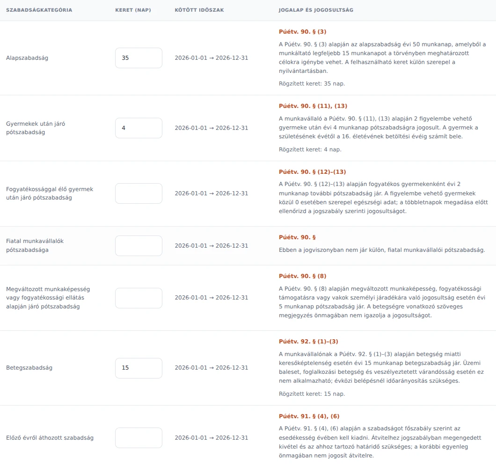

# People, approvals and leave entitlements

The portal now shows its full Hungarian and English names. Hungarian role labels are **Igazgató**, **Óvodavezető** and **Óvodavezető-helyettes**; their English equivalents are **Director**, **Nursery head** and **Deputy nursery head**. Stored `ceo`, `principal` and `deputy principal` values and permissions remain compatible with existing data.

## Personal records

- `/profile` uses **Tartózkodási hely**, removes the teacher-ID character count from the label, and explains that the disability/long-term illness field can be left blank. The existing 64-character storage capacity is unchanged.
- `/dependents` lists the signed-in user's existing records. Add and edit forms return to this list, preserve invalid input and validate dates, names and nine-digit social security numbers before updating a record. Editing another user's record returns 404; form submissions require a session CSRF token.
- `/dashboard` shows all colleagues celebrating a birthday today at a shared workplace, based on contracts active on that date. Multiple contracts do not duplicate a person. A birthday greeting replaces this reminder on the user's own birthday. The date uses `Europe/Budapest`; the reminder shows names without birth years or ages. Leap-day birthdays appear on 29 February.

## Named approvers

The calendar resolves names for the selected contract and the current policy. Directors are the existing global `ceo` accounts; nursery leaders are the currently assigned leaders of that contract's legal entity. A deputy's own application excludes that deputy from the eligible names.

All four policies are supported. People are deduplicated by user ID, including a director who is also the nursery head. A single dual-role decision can satisfy both requirements, so the text does not invent an additional deputy approval. Multiple directors and leaders retain their valid alternative paths. Identical full names are distinguished by username. Missing assignments produce an actionable message.

## Legal basis in the allowance tables

Each relevant row links to the applicable legislation and explains the entitlement in Hungarian or English. Child counts, the selected year, age supplements and paternity birth/deadline dates are calculated from the selected employee's records. Existing custom validity periods are displayed, and dynamically added rows retain their explanation.

References were checked on 28 September 2026 against the official National Legislation Database:

- [Púétv. — Act LII of 2023](https://njt.jog.gov.hu/jogszabaly/2023-52-00-00): sections 71 and 90–94.
- [Mt. — Act I of 2012](https://njt.jog.gov.hu/jogszabaly/2012-1-00-00): sections 55, 116–123 and 126–130.

The legal entitlement and the editable recorded allowance are separate. For Púétv. basic leave, the explanation states the 50-day statutory amount and the employer's permitted use of up to 15 days; the portal's existing 35-day available-allowance default is preserved. Displaying an explanation never imports or overwrites saved limits.

Paternity explanations give the end of the fourth month following each recorded birth whose window overlaps the selected year. Adoption decisions, grandchild births and marriage dates are not stored in dedicated fields, so those situations need the supporting event record. Free-text health notes do not establish statutory disability eligibility; the explanations make that condition explicit. Existing health-note-based default suggestions still require HR verification. For years before 2025 the interface requests the legislation applicable to that historical year instead of presenting today's durations as historical facts.

The shared age-supplement calculation now includes the year of each threshold birthday (for example, 25 gives one day). Child counts exclude births or dependency starts after the selected year. The separate young-employee default applies to Mt. contracts. These corrections affect subsequent default imports; saved allowances are not recalculated on deployment.

## Verification and previews

- 40 automated tests pass, covering ownership and validation, all four approval policies, overlapping roles, workplace/date boundaries, multiple birthdays, Budapest dates, leave-law references, age thresholds and paternity deadlines.
- 96 browser page/locale/viewport checks cover Hungarian and English at 320, 390, 768 and 1440 pixels. Create/edit flows, multiple/own birthdays, legal table column alignment and add/remove rows were exercised. Targeted final checks cover the birthday icon, narrow login layout and actual policy-setting-to-applicant flows for all four policies.
- The Hungarian catalogue is fully translated, compiled and checked for format placeholders. No JavaScript errors or document-level horizontal overflow were observed. Wide tables scroll within their own containers.
- Verification used SQLite and local Chromium. Production MySQL and deployment were not exercised. No schema migration is required.

Screenshots use fictional records in a disposable database.

